<!--
  Identity — "Chrome" (mirrors https://abdelrahman-yasser.vercel.app/)
  void #070708 · abyss #0c0c0e · carbon #121214 · seam #2a2a2e
  bone #f2f2f3 · fog #8f8f96 · mist #5d5d63 · silver #e9e9ec · soft silver #b4b4bb
  Artwork: ./assets (desktop, 1200px) and ./assets/mobile (phones, 600px),
  switched with <picture> at 700px.
-->

<a href="https://abdelrahman-yasser.vercel.app/">
<picture>
  <source media="(max-width: 700px)" srcset="./assets/mobile/header.svg"/>
  
</picture>
</a>

<picture>
  <source media="(max-width: 700px)" srcset="https://readme-typing-svg.demolab.com?font=Geist+Mono&weight=500&duration=3000&pause=800&color=E9E9EC&center=true&vCenter=true&lines=Building+scalable+mobile+apps;Crafting+maintainable+frontend+architectures;Leveraging+AI+for+engineering+productivity;Always+learning+%C2%B7+Always+shipping&size=15&width=420"/>
  
</picture>

<picture>
  <source media="(max-width: 700px)" srcset="./assets/mobile/about.svg"/>
  
</picture>

<picture>
  <source media="(max-width: 700px)" srcset="./assets/mobile/expertise.svg"/>
  
</picture>

<picture>
  <source media="(max-width: 700px)" srcset="./assets/mobile/toolkit.svg"/>
  
</picture>

<picture>
  <source media="(max-width: 700px)" srcset="./assets/mobile/activity.svg"/>
  
</picture>

<picture>
  <source media="(max-width: 700px)" srcset="./assets/mobile/contact.svg"/>
  
</picture>

<a href="mailto:abdelrahman.yasser.365@gmail.com">
<picture>
  <source media="(max-width: 700px)" srcset="./assets/mobile/contact-email.svg"/>
  
</picture>
</a>

<a href="https://wa.me/201019347297?text=Hi!%20Let's%20collaborate!">
<picture>
  <source media="(max-width: 700px)" srcset="./assets/mobile/contact-phone.svg"/>
  
</picture>
</a>

<a href="https://wa.me/201019347297?text=Hi!%20Let's%20collaborate!">
<picture>
  <source media="(max-width: 700px)" srcset="./assets/mobile/contact-whatsapp.svg"/>
  
</picture>
</a>

<a href="https://www.linkedin.com/in/abdelrahman-yasser-346491197/">
<picture>
  <source media="(max-width: 700px)" srcset="./assets/mobile/contact-linkedin.svg"/>
  
</picture>
</a>

<a href="https://abdelrahman-yasser.vercel.app/">
<picture>
  <source media="(max-width: 700px)" srcset="./assets/mobile/contact-portfolio.svg"/>
  
</picture>
</a>

<a href="https://flowcv.com/resume/92tbwssbh8">
<picture>
  <source media="(max-width: 700px)" srcset="./assets/mobile/contact-resume.svg"/>
  
</picture>
</a>

<picture>
  <source media="(max-width: 700px)" srcset="./assets/mobile/footer.svg"/>
  
</picture>

