<!--
  Identity — "Signal" (mirrors abdelrahman-yasser.vercel.app)
  void #06070a · abyss #0b0d12 · carbon #11141b · seam #262b38
  bone #eef0f4 · fog #8a90a0 · mist #5b6170
  volt #c8ff2e · ion #3df5ff · flare #ff4d6d
  Custom artwork lives in ./assets
-->

  

  

  

    
    
    
    
  

  

    
    
    
    
    
  

  

 

I'm a software engineer based in **Cairo** who specialises in **mobile** — living at the intersection of engineering rigor and interface craft. At **Ejada** I ship React Native SDKs used by banks and government apps across Saudi Arabia, dropping into **Swift** and **Kotlin** whenever the platform demands it.

I care about the details nobody asks for: _60fps gestures, zero-crash releases, and code the next engineer will thank me for._

  

| | |
| :-- | :-- |
| **`MOBILE`** |        |
| **`LANGUAGES`** |   |
| **`WEB & UI`** |    |
| **`STATE & DATA`** |      |
| **`DELIVERY`** |      |
| **`AI WORKFLOW`** |    |

 

<table>
  <tr>
    <td width="200" valign="top"><code>NOV 2023 — NOW</code></td>
    <td>
      <b>Software Engineer — Mobile</b> · <a href="https://ejada.com">Ejada Systems</a> · Cairo, Egypt 
      Production-grade React Native SDKs and apps for enterprise clients across banking, government and identity verification.
      <ul>
        <li>Built a KYC SDK with on-device ML liveness detection and face matching — core logic in Swift &amp; Kotlin</li>
        <li>Shipped a Community Chat SDK running inside Al-Rajhi Bank's mobile banking app</li>
        <li>Developed Esaal, a drop-in AI chat SDK for third-party apps</li>
        <li>Migrated 20K+ lines of legacy JavaScript to TypeScript</li>
        <li>Delivered the Saudi Ministry of Sport app with 70% unit-test coverage</li>
      </ul>
    </td>
  </tr>
  <tr>
    <td width="200" valign="top"><code>2024 — NOW</code></td>
    <td>
      <b>React Native Developer</b> · Freelance · Remote 
      Rescuing, upgrading and shipping React Native apps to both stores for independent clients.
      <ul>
        <li>Took SPC Academy from a broken legacy state to a stable store release (20+ critical fixes)</li>
        <li>Built Bastah's dual-role creator/user flows and unblocked Play Store publishing</li>
      </ul>
    </td>
  </tr>
  <tr>
    <td width="200" valign="top"><code>SEP — OCT 2023</code></td>
    <td>
      <b>Android Developer Intern</b> · <a href="https://www.codsoft.in">CodSoft</a> · Remote 
      Native Android apps in Java with Room, Retrofit, MVVM and Material Design.
    </td>
  </tr>
</table>

 

  
  

  
  

  

 

  
  

  

 

  <code>● AVAILABLE</code> — Open to freelance &amp; full-time roles · Cairo, Egypt (GMT+2) · Open to relocation

  

  
  
  
  
  

 

  
   
  

