<!--
  Identity — "Signal" (mirrors abdelrahman-yasser.vercel.app)
  void #06070a · abyss #0b0d12 · carbon #11141b · seam #262b38
  bone #eef0f4 · fog #8a90a0 · mist #5b6170
  volt #c8ff2e · ion #3df5ff · flare #ff4d6d
  Custom artwork lives in ./assets
-->

  

  

  

    
    
    
    
  

  

    
    
    
    
    
  

  

    
    
    
  

  

 

<table>
  <tr>
    <td width="50%" valign="top">
      <code>WHAT I BRING</code>
      <ul>
        <li>Ships production-ready mobile apps at scale</li>
        <li>Writes clean, typed, testable code</li>
        <li>Bridges AI tooling into real engineering workflows</li>
        <li>Collaborates across design, product &amp; backend teams</li>
      </ul>
    </td>
    <td width="50%" valign="top">
      <code>GROWING IN</code>
      <ul>
        <li>Enterprise architecture</li>
        <li>Native modules &amp; the bridge</li>
        <li>Performance optimization</li>
        <li>AI agents &amp; workflows</li>
      </ul>
    </td>
  </tr>
</table>

 

  

  

  
  
  
  
  
  
  
  

 

  
  

 

  

  
  
  
  

  
  
  

 

  

